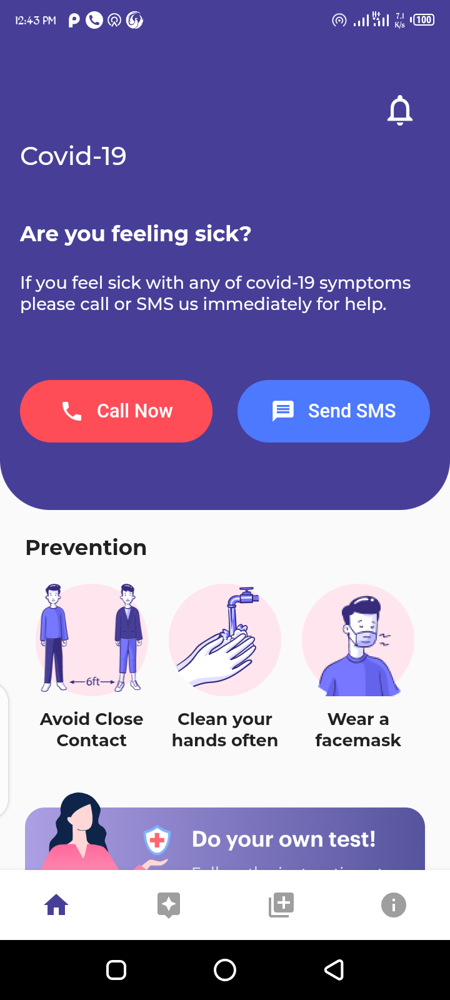
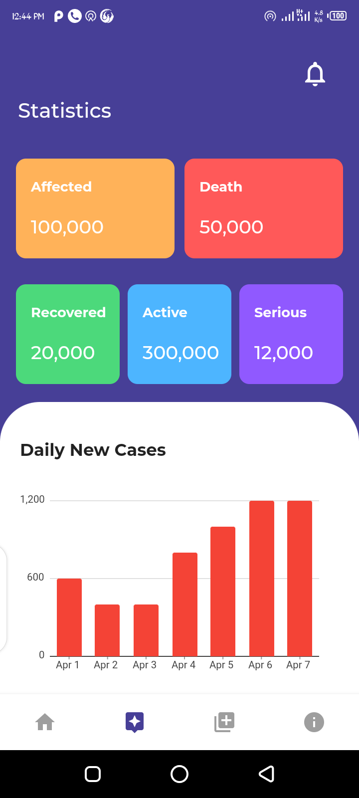

# covid19

A new Flutter application.

## Getting Started With Flutter

This project is a starting point for a Flutter application.

A few resources to get you started if this is your first Flutter project:

- [Lab: Write your first Flutter app](https://flutter.dev/docs/get-started/codelab)
- [Cookbook: Useful Flutter samples](https://flutter.dev/docs/cookbook)

For help getting started with Flutter, view our
[online documentation](https://flutter.dev/docs), which offers tutorials,
samples, guidance on mobile development, and a full API reference.

## App Screenshots

## Getting Started
Clone or fork the project from [here](https://github.com/KingsleyUsoroeno/Covid19-Flutter-App) if you wish to make changes to the current project, you have a atleast Android Studio 3.4.1 or Visual Studio Code to get started, as well as the flutter SDK installed on your machine
